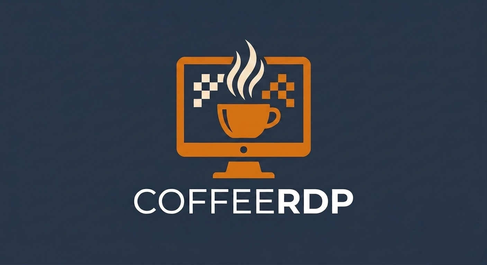

# CoffeeRDP



A minimal RDP client for Linux, built on [FreeRDP](https://www.freerdp.com/)'s
SDL3 client, with a GTK4 connection manager on top.

Goals:

- Wayland-first, with an automatic X11 fallback when Wayland can't deliver
- Persistent Entra ID (AAD) login instead of a full MFA challenge every
  connection
- An idle keep-alive so sessions don't disconnect while you're away
- An in-session control bar (disconnect, fullscreen, keyboard capture, send
  Ctrl+Alt+Del, connection quality)
- Selectable connection quality presets
- A connection manager with saved profiles and in-place `.rdp` editing

## Status

Under active development, see `PLAN.md` for full details and open issues.
Working today: the session client, quality presets, idle keep-alive, an
in-session control bar, persistent AAD login, and a GTK4 connection manager
that saves profiles and can import, export, and edit `.rdp` files in place.
A full connect launched from the GUI has not yet been verified.

## Building

Requires FreeRDP 3's development packages (`freerdp3`, `freerdp-client3`,
`winpr3`), SDL3 and SDL3_ttf, GTK4, libadwaita, and webkitgtk 6.0.

```sh
cmake -S . -B build -GNinja
ninja -C build
```

## Layout

```
src/session/   SDL3 session client (forked from FreeRDP's client/SDL/SDL3
               and client/SDL/common), built at build/src/session
src/auth/      Standalone GTK4/WebKit AAD login helper, run as a subprocess
               by the session client, built at build/src/auth
src/manager/   GTK4 connection manager, built at build/src/manager
resources/     Bundled assets: fonts and the app icon
```
